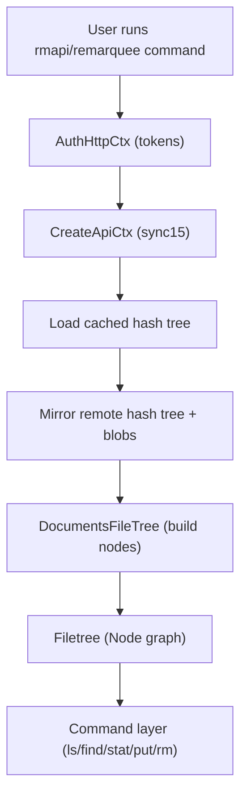

# rmapi Filetree and Sync15 Model: A Practical Textbook

This document is a structured, end-to-end explanation of how rmapi models
reMarkable data, how the Sync15 layer is mirrored locally, and how the
`filetree` abstraction is built and used by commands like `ls`, `find`,
`stat`, `put`, and `rm`.

The goal is to make the internal model understandable enough to implement
new features or debug unexpected behavior without re-reading the code every
time.

## Table of Contents

- 1. Big picture: rmapi layers and data flow
- 2. The core domain model (Document and Node)
- 3. Sync15: hash tree, blob storage, and mirroring
- 4. From Sync15 to Filetree: how nodes are built
- 5. Filetree operations: lookup, globbing, and traversal
- 6. How common commands use the model
- 7. Known limitations and sharp edges
- 8. Glossary
- 9. Key source files

## 1. Big picture: rmapi layers and data flow

rmapi is built as a few layers that transform server state into a local,
queryable tree:

1) Transport + auth layer
2) Sync15 layer (hash tree + blobs)
3) Filetree layer (nodes, paths, traversal)
4) Shell and command layer (ls, find, stat, put, rm, etc.)

Data flow looks like this:

```
remote reMarkable API
  -> Sync15 mirror (hash tree + blob storage)
     -> DocumentsFileTree (rmapi/filetree)
        -> commands (ls/find/stat/put/...)
```

rmapi does not maintain a full relational database. The filetree is rebuilt
from the Sync15 mirror and kept in memory.

## 2. The core domain model (Document and Node)

rmapi models each entry (document or folder) as a `model.Document` and wraps
it in a `model.Node` inside a filetree.

### 2.1 Document

The `Document` is a compact record of the fields rmapi cares about for most
operations:

```
type Document struct {
    ID             string
    Name           string
    Version        int
    ModifiedClient string
    Type           string
    CurrentPage    int
    Parent         string
}
```

Important points:

- `Type` is one of:
  - `CollectionType` (directory)
  - `DocumentType` (file)
  - `TemplateType` (template file)
- `ModifiedClient` is a string timestamp; `Node.LastModified()` parses it
  into a `time.Time`.
- Fields such as pinned, deleted, or synced are **not** in `Document` even
  though they exist in metadata files. That data is not exposed via the
  public API and is not in the filetree model.

### 2.2 Node

`Node` wraps a Document and adds tree structure:

```
type Node struct {
    Document *Document
    Children map[string]*Node
    Parent   *Node
}
```

Key helpers:

- `IsRoot()` - ID == ""
- `IsDirectory()` - Type == CollectionType
- `IsFile()` - not a directory
- `FindByName(name)` - exact match in children
- `FindByPattern(pattern)` - glob match on child names, case-insensitive

## 3. Sync15: hash tree, blob storage, and mirroring

Sync15 is the API and storage model used by the reMarkable cloud service.
rmapi implements a client that:

1) Mirrors the remote hash tree
2) Pulls metadata blobs for each entry
3) Builds an in-memory tree for fast navigation

### 3.1 ApiCtx creation

Creating the API context does the heavy lifting:

- `rmapi/api/api.go` defines the public `ApiCtx` interface.
- `rmapi/api/sync15/apictx.go` implements the Sync15 version.

The sequence:

1) `CreateCtx(http)` loads a cached hash tree.
2) `Mirror(...)` fetches updates from the remote storage.
3) The tree is saved locally.
4) `DocumentsFileTree(...)` builds the filetree from the mirrored hash tree.

This means `CreateCtx(...)` already performs a refresh-like sync.

### 3.2 Blob docs and metadata

The Sync15 tree stores documents as "blob docs". Each doc holds file entries
and a metadata file. In `rmapi/api/sync15/blobdoc.go`, `ReadMetadata(...)`
loads and parses the metadata file, then `ToDocument()` converts it into the
simple `Document` struct used by the filetree.

Important: this conversion discards extra metadata fields (pinned, deleted,
synced). Those values exist in `archive.MetadataFile` but are not surfaced in
the filetree model.

### 3.3 Refresh behavior

`ApiCtx.Refresh()` re-mirrors the hash tree and rebuilds the filetree. Commands
that read the filetree typically call `CreateCtx(...)` and then operate on the
freshly built tree.

## 4. From Sync15 to Filetree: how nodes are built

The filetree is a lightweight representation of the document hierarchy.

Steps:

1) Sync15 mirror produces a list of documents with IDs and parents.
2) `DocumentsFileTree(...)` (in sync15 tree code) creates a `FileTreeCtx`.
3) Each document is added with `FileTreeCtx.AddDocument(...)`.
4) Parent-child relations are resolved by ID, and missing parents are staged
   in `pendingParent` until they arrive.

### 4.1 Root and trash

`FileTreeCtx` creates a root node with ID "" and a special trash node with
ID `TrashID`.

The root node is the anchor for path resolution and traversal. The trash node
is attached as a child of root.

### 4.2 Parent resolution

`AddDocument(...)` inserts a node into the `idToNode` map and then:

- If parent ID is known, attach as child.
- If not, store in `pendingParent` until the parent arrives.

`FinishAdd()` connects any remaining pending children to the root.

## 5. Filetree operations: lookup, globbing, and traversal

### 5.1 NodeByPath

`NodeByPath(path, current)` is the "cd and stat" path resolver.

Rules:

- Absolute paths start with "/" and reset the current node to root.
- `.` and `..` are supported.
- Each segment is matched by **exact name**.

### 5.2 NodesByPath (globbing on last segment)

`NodesByPath(path, current, ignoreTrailingSlash)` supports glob patterns on
the final path segment only.

Example:

- `/Books/*.pdf` matches PDFs inside `/Books`.
- `/Books/*/notes` does **not** glob at intermediate segments.

Matching uses `filepath.Match` on lowercased names.

Pseudocode (simplified):

```
nodesByPath(path, current):
  entries = split(path, "/")
  for each entry in entries:
    if entry is "." or "":
      continue
    if entry is "..":
      current = current.Parent or root
      continue
    if entry is last:
      return current.FindByPattern(entry)  # glob, case-insensitive
    else:
      current = current.FindByName(entry)  # exact match
```

### 5.3 WalkTree

`WalkTree(start, visitor)` traverses children recursively.

Important detail: children are stored in a `map`, so traversal order is not
deterministic. If you need stable output, collect matches and sort them.

Pseudocode (simplified):

```
WalkTree(node, visitor):
  doWalk(node, [], visitor)

doWalk(node, path, visitor):
  if visitor.Visit(node, path) == true:
    return STOP
  newPath = path + [node.Name()]
  for child in node.Children:   # map iteration, not stable order
    if doWalk(child, newPath, visitor) == STOP:
      return STOP
  return CONTINUE
```

## 6. How common commands use the model

### 6.1 ls

- Uses `NodesByPath(...)` to resolve patterns.
- Sorts entries by name or time.
- Optional filters (directory-first, show templates).

### 6.2 find

- Uses `WalkTree(...)` to traverse from a start node.
- Matches a Go regex against the **formatted output string**.
- The formatted string includes "[d] " or "[f] " when not in compact mode.

Pseudocode (simplified):

```
find(start, pattern, compact):
  re = compile(pattern) if pattern else nil
  WalkTree(start, visitor):
    entry = formatEntry(node, compact)  # includes [d]/[f] prefix if not compact
    if re is nil or re matches entry:
      print entry
    return CONTINUE
```

### 6.3 stat

- Uses `NodeByPath(...)` and prints the `Document` fields for one entry.

### 6.4 put, mkdir, mv, rm

- Mutations go through Sync15 APIs and then update the filetree.
- Deleting or moving must keep the local filetree consistent with remote
  state, so operations generally modify both the remote store and the
  in-memory tree.

## 7. Known limitations and sharp edges

- **Metadata visibility**: filetree nodes do not expose pinned/deleted/synced
  flags even though they exist in metadata files.
- **Traversal order**: `WalkTree` is map order and is not stable.
- **Globbing scope**: only the last path segment uses glob patterns.
- **Find matching**: regex is matched against the formatted output, not raw
  paths or names.
- **Time parsing**: `ModifiedClient` parsing can fail; handle errors if you
  rely on timestamps.

## 7.1 API call flow (Sync15 and filetree build)

This diagram shows how rmapi moves from auth to a populated filetree, and how
commands sit on top.



## 7.2 Hash tree cache, refresh timing, and remote cost

The hash tree cache is a local JSON snapshot used to avoid full re-syncs on
every command run.

### Where the cache lives

- Stored at `os.UserCacheDir()/rmapi/tree.cache`.
- `getCachedTreePath()` creates the cache directory if missing.
- Cache is versioned (`cacheVersion = 3`); mismatches trigger a resync.

See `rmapi/api/sync15/common.go`.

### When it refreshes

- `CreateCtx(...)` always loads the cache and then calls `Mirror(...)`.
- `ApiCtx.Refresh()` explicitly re-mirrors and rebuilds the filetree.
- Mutations (`put`, `rm`, `mv`, etc.) call `Sync(...)`, which can re-mirror on
  generation conflict and then saves the cache.

See `rmapi/api/sync15/apictx.go`.

### Remote call cost

`Mirror(...)` always fetches the root index hash and generation. If the hash
matches the cached tree, it returns quickly without downloading per-document
indexes. If the hash differs, it downloads the root index and then pulls
doc-level indexes and metadata for new or changed documents. This is a global
sync, not directory-by-directory traversal.

See `rmapi/api/sync15/tree.go` and `rmapi/api/sync15/blobdoc.go`.

## 8. Glossary

- **Sync15**: reMarkable cloud sync protocol implemented by rmapi.
- **Blob**: immutable object stored in remote storage; documents are composed
  of blobs.
- **Hash tree**: tree of entries that rmapi mirrors locally.
- **Filetree**: in-memory `Node` graph representing the folder/document
  hierarchy.
- **Document**: compact metadata view used by the filetree and commands.

## 9. Key source files

- `rmapi/api/api.go` - public ApiCtx interface.
- `rmapi/api/sync15/apictx.go` - Sync15 ApiCtx implementation and mirror flow.
- `rmapi/api/sync15/blobdoc.go` - metadata parsing and Document conversion.
- `rmapi/api/sync15/tree.go` - hash tree and filetree construction helpers.
- `rmapi/filetree/filetree.go` - FileTreeCtx and path resolution.
- `rmapi/filetree/treeutil.go` - tree traversal utilities.
- `rmapi/model/document.go` - Document structure and types.
- `rmapi/model/node.go` - Node structure and helpers.
- `rmapi/archive/file.go` - metadata fields that are not surfaced in Document.
