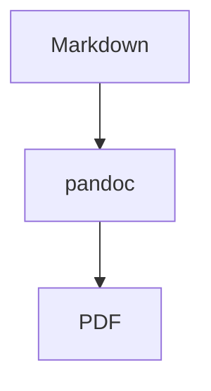

# Markdown format support

This page documents what actually survives the trip from a `.md` file to a PDF on
a reMarkable device: what renders, what is transformed, what is silently dropped,
and which flags change the behavior.

## The pipeline (why this page exists)

reMarkable never receives your Markdown. The conversion is:

```
.md
  → strip YAML frontmatter
  → resolve/convert images, inline SVG, Mermaid
  → normalize list spacing, flatten deep lists
  → pandoc --from=markdown --pdf-engine=xelatex
  → PDF  → upload
```

Two consequences:

1. Anything pandoc's **LaTeX writer** cannot represent may be dropped without a
   warning. The most common example is raw HTML.
2. Anything that requires an external tool (`rsvg-convert` for SVG, `mmdc` for
   Mermaid) degrades differently depending on whether that tool is installed.

Use `remarquee upload md <file> --pdf-only --output-dir ./out` to inspect the PDF
without uploading.

## Support matrix (quick reference)

| Feature | Status | Notes |
|---|---|---|
| Headings, emphasis, links | ✅ | Standard pandoc Markdown |
| Bullet / numbered lists | ✅ | Nested lists flattened to a maximum depth of 4 |
| Tables (pipe tables) | ✅ | Standard pandoc Markdown |
| Blockquotes, horizontal rules | ✅ | |
| Fenced code blocks | ✅ | Preserved verbatim; optional syntax highlighting |
| Indented code blocks | ✅ | Preserved verbatim |
| Inline math `$...$` | ✅ | Requires math packages (bundled in the default header) |
| Display math `$$...$$` | ✅ | |
| `\(...\)` / `\[...\]` math | ✅ | Reader extension enabled |
| `\require{...}` (MathJax) | ✅ | No-op definition; safe |
| Local images `` | ✅ | Relative to the Markdown file's directory |
| Reference-style images `![a][id]` | ✅ | Definitions are resolved and copied |
| Image sizing `{width=...}` | ✅ | `%`, `px`, `cm`, etc. |
| SVG as an image reference | ✅ | Converted by pandoc via `rsvg-convert` |
| Inline raw `<svg>…</svg>` | ✅ | Extracted and converted by remarquee |
| HTML `` | ✅ | Rewritten to Markdown, then converted |
| `data:image/svg+xml;base64,…` | ✅ | Handled by pandoc |
| Mermaid ` ```mermaid ` blocks | ✅¹ | Requires `mmdc` (mermaid-cli) |
| YAML frontmatter | ✅ (stripped) | Removed before pandoc; never printed |
| Absolute/remote image paths | ⚠️ | Not copied; passed through to pandoc |
| Raw HTML (other than SVG ``) | ❌ | Dropped by the LaTeX writer |
| Nested lists deeper than 4 | ⚠️ | Flattened to depth 4 |
| Embedding video / audio | ❌ | Not a PDF feature |
| Unsupported LaTeX packages | ❌ | Only the default header + your `--latex-header-file` are loaded |

¹ When `mmdc` is absent, Mermaid blocks are left as plain code listings instead of
diagrams.

## YAML frontmatter

A leading `---` block is stripped before conversion, so docmgr-style metadata never
appears in the PDF and cannot break the pandoc YAML parser. A `---` thematic break
elsewhere in the document is unaffected (the `yaml_metadata_block` extension is
disabled).

## Math

Inline and display math are supported, along with the MathJax-style `\(...\)` and
`\[...\]` delimiters. The default LaTeX header loads the packages needed for common
symbols exported from AI chats:

- `stmaryrd` (`\llbracket`, `\rrbracket`, `\rightsquigarrow`)
- `centernot` (`\centernot\Longrightarrow`)
- `mathtools` / `amscd` (extensible arrows, `CD` commutative diagrams)
- MathJax's `\require{...}` is defined as a no-op so surrounding math still compiles

Pass `--latex-header-file` to add packages yourself. `--pandoc-from` controls the
pandoc reader extensions if you need a different math dialect.

## Images

Markdown image syntax works in all its forms:

```markdown
          <!-- relative path -->
![diagram][arch]                        <!-- reference style -->
[arch]: ./assets/arch.png

{width=60%} <!-- sized -->
```

Behavior:

- Relative paths are resolved against the directory of the Markdown file and copied
  into the conversion temp directory.
- Absolute paths and `http(s)://` URLs are **not** copied; pandoc receives them
  as-is.
- `--resolve-images=false` disables image resolving and copying entirely (and also
  disables HTML `` rewriting, which depends on it).

## SVG

SVG has three authoring forms; all are supported now.

### 1. Referenced SVG (already vector)

```markdown

```

Pandoc converts this to a vector PDF using `rsvg-convert` and includes it with
`\includegraphics`. No LaTeX shell escape is involved.

### 2. Inline raw SVG

```markdown
<svg xmlns="http://www.w3.org/2000/svg" viewBox="0 0 100 100">
  <circle cx="50" cy="50" r="40" fill="steelblue"/>
</svg>
```

remarquee extracts the block (skipping fenced code), converts it to a vector PDF,
and substitutes a Markdown image. This is a change from older releases, where raw
`<svg>` blocks were silently dropped.

### 3. HTML `` referencing an SVG

```markdown

```

remarquee rewrites this to `{width=300px}` and
then handles it like a normal referenced image.

### SVG flags

- `--svg` (default `true`): enable/disable inline block and HTML `` handling.
  Disabling leaves them to pandoc, which drops them.
- `--svg-converter PATH`: use a specific converter (default: auto-detect
  `rsvg-convert`, then `inkscape`).
- `--svg-default-width W`: width applied to extracted inline SVGs (e.g. `70%`,
  `12cm`). Default is the SVG's natural size.

### Converter requirements and degradation

- Referenced SVG needs `rsvg-convert` on `PATH` (pandoc falls back to the LaTeX
  `svg` package, which requires `--shell-escape` and fails in this pipeline).
- Inline/HTML SVG uses remarquee's own converter. If none is found, remarquee warns
  and leaves the source unchanged, and the document still converts:

  ```
  WARNING: SVG: no SVG converter found; inline <svg> blocks left as-is
  ```

### Limitations

- SVG features unsupported by `rsvg-convert` (some CSS, filters, `foreignObject`)
  will not render. On conversion failure, remarquee warns and leaves the block.
- Only `` tags whose `src` ends in `.svg` are rewritten; other HTML images are
  still dropped by the LaTeX writer.

## Mermaid

Fenced ```` ```mermaid ```` blocks are rendered to PNG diagrams when `mmdc`
(mermaid-cli) is installed:

````markdown

````

Flags: `--mermaid` (enable), `--mmdc-path`, `--mermaid-scale`, `--mermaid-theme`,
`--mermaid-bg`, `--mermaid-width`, `--mermaid-no-sandbox`, `--mermaid-pdf-width`.

If `mmdc` is missing, blocks are left as plain code listings (warn and continue).

## Code blocks

Fenced and indented code are preserved verbatim. List-spacing normalization never
touches code fences or display math. `remarquee upload src` adds syntax
highlighting via `--theme` (pandoc highlight style) and `--listings`.

## Not supported

- Raw HTML other than SVG `` (tables, `<div>`, `<details>`, `<video>`, …):
  dropped by the LaTeX writer.
- Lists nested deeper than 4 levels: flattened to 4 (LaTeX's limit).
- Arbitrary LaTeX beyond the default header and `--latex-header-file`.
- Remote asset fetching: URLs are passed to pandoc, which may or may not fetch
  them depending on your pandoc configuration.

## Layout and bundles

- `--layout editor` uses wider margins and looser spacing for annotation-heavy
  reading.
- `remarquee upload bundle` concatenates inputs with a table of contents
  (`--toc-depth`) and a page break between documents.

## Troubleshooting

- **`Package svg Error: File ... is missing`** — a referenced SVG could not be
  converted; install `rsvg-convert` (or pass `--svg-converter`).
- **A diagram is missing with no error** — it was likely raw HTML (dropped) or a
  disabled feature; check `--svg` / `--mermaid` and the converter's presence.
- **`Missing character` warnings in a local test render** — usually an artifact of
  rendering without remarquee's DejaVu font variables. The real pipeline uses
  DejaVu Sans / DejaVu Sans Mono.
- **`Unknown alias` from pandoc** — usually malformed code-block fences.
