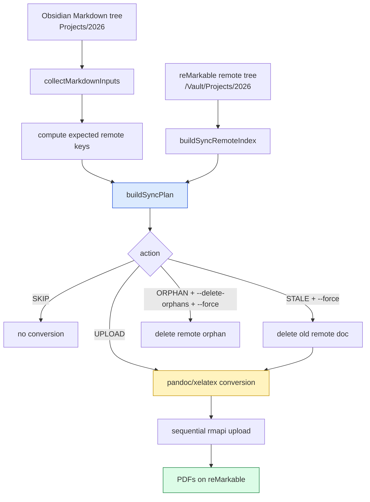
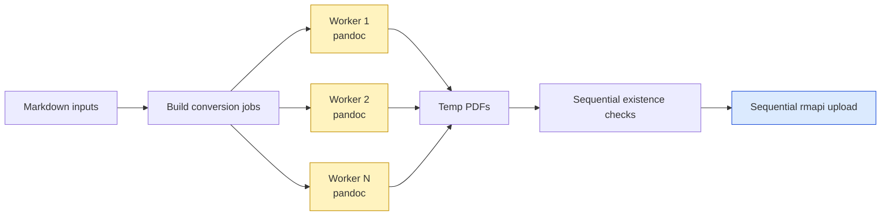

# Obsidian to reMarkable Sync - Native Delta Upload and Vault Report Pipeline

This article explains the implementation of RM-SYNC-001: a practical pipeline for converting an Obsidian vault subtree into PDFs and placing those reports on a reMarkable tablet. The final system does three related jobs. It can plan a one-way sync by comparing local Markdown files with the remote reMarkable tree. It can upload only the computed delta. It can accelerate full uploads by running Markdown-to-PDF conversion in parallel while keeping reMarkable cloud mutations sequential.

> [!summary]
> - `remarquee upload sync` computes a remote-path keyed plan before conversion, so unchanged Markdown files are skipped before pandoc runs.
> - `remarquee upload md --workers N` parallelizes pandoc/xelatex conversion, while rmapi upload remains sequential for filetree safety.
> - The live run uploaded 265 Obsidian project reports from `/home/manuel/code/wesen/obsidian-vault/Projects/2026` to `/Vault/Projects/2026` on the reMarkable tablet.
> - A pandoc filename bug involving `#` in temporary paths was found during the live upload and fixed in `pkg/mdpdf/pandoc.go`.

## Why this project exists

The source material is an Obsidian vault. The relevant subtree is `/home/manuel/code/wesen/obsidian-vault/Projects/2026`, where project reports and technical articles are stored as Markdown files under dated folders such as `2026/04/21/`. The target device is a reMarkable tablet. The useful reading format on that device is PDF. The operational requirement is direct: every selected Markdown report should appear on the tablet as a PDF, with the original date hierarchy preserved.

The first implementation question is not how to call pandoc. `remarquee upload md` already knew how to convert Markdown to PDF and upload the result. The important question is where to place the remote existence check. In the old upload path, the command converted each Markdown file first, then asked the reMarkable cloud tree whether the corresponding document already existed. That ordering is correct for a small one-shot upload, but it is poor for a vault sync. If 260 documents already exist and 5 are new, the old command still pays for 265 pandoc/xelatex conversions before skipping 260 documents.

A sync command needs a different order of operations. It should first construct a model of local intent and remote reality. Only after it knows which files are missing or stale should it run expensive conversion. This is the core design change in RM-SYNC-001.

## The final user-facing commands

There are two commands to understand.

The first command is the delta-aware sync command:

```bash
remarquee upload sync \
  --dry-run \
  --non-interactive \
  --remote-dir /Vault/Projects/2026 \
  /home/manuel/code/wesen/obsidian-vault/Projects/2026
```

A dry run prints a plan. Before the live upload, the plan said all 265 files were missing remotely:

```text
SYNC: remote-dir=/Vault/Projects/2026
SUMMARY: upload=265 skip=0 stale=0 orphan=0
```

After the live upload, the same dry run became an idempotency check:

```text
SYNC: remote-dir=/Vault/Projects/2026
SUMMARY: upload=0 skip=265 stale=0 orphan=0
```

The second command is the high-throughput Markdown upload command:

```bash
go run ./cmd/remarquee upload md \
  --non-interactive \
  --workers 8 \
  --remote-dir /Vault/Projects/2026 \
  --preserve-dirs \
  /home/manuel/code/wesen/obsidian-vault/Projects/2026
```

This command was used for the live upload because the first run had no remote documents to skip. The `--workers 8` flag made the CPU-heavy conversion phase practical for the full subtree. Upload still happened sequentially after conversion, which avoids concurrent mutation of rmapi's local filetree.

## Architecture at a glance

The project is organized around one invariant: expensive conversion should happen only for documents that need to be uploaded or replaced. The sync path enforces that invariant by planning before conversion. The upload path accelerates first-run conversion when everything needs to be uploaded.



The implementation lives mostly in these files:

| File | Responsibility |
| --- | --- |
| `cmd/remarquee/cmds/upload/sync_plan.go` | Pure sync planning model: classify local and remote documents as upload, skip, stale, or orphan. |
| `cmd/remarquee/cmds/upload/sync.go` | Cobra command, remote index construction, dry-run output, sync execution, stale replacement, orphan deletion safety. |
| `cmd/remarquee/cmds/upload/md.go` | Existing Markdown upload command, now extended with `--workers`. |
| `cmd/remarquee/cmds/upload/conversion_workers.go` | Worker pool for parallel pandoc conversion jobs. |
| `cmd/remarquee/cmds/upload/upload_helpers.go` | Shared remote PDF upload helper used by `upload md` and `upload sync`. |
| `pkg/mdpdf/pandoc.go` | Markdown preprocessing and pandoc invocation. |
| `pkg/mdpdf/pandoc_test.go` | Regression test for source filenames containing `#`. |
| `cmd/remarquee/internal/appconfig/parser.go` | Shared Glazed config plan setup for Glazed-backed commands. |

## The sync planner

The planner is deliberately pure. It does not authenticate to reMarkable. It does not run pandoc. It does not upload or delete documents. It receives local Markdown inputs, a remote index, and settings, then returns a list of plan items.

The central decision is the remote key. The bash prototype used leaf names. That was enough to prove the workflow, but it is not correct for a dated vault. Two different folders can contain files with the same basename. A native command must use the full expected remote path.

For a local file:

```text
/home/manuel/code/wesen/obsidian-vault/Projects/2026/04/21/PROJ - Smailnail - Review UI PR #3.md
```

with remote base:

```text
/Vault/Projects/2026
```

and preserved directory structure, the expected remote key is:

```text
/Vault/Projects/2026/04/21/PROJ - Smailnail - Review UI PR #3
```

The key is extensionless because rmapi document names are extensionless in the filetree. The final upload source is a PDF, but the reMarkable document node is named without `.pdf`.

The planning algorithm can be written as follows:

```text
for each local markdown input:
    pdfName  = basename(input, ".md") + ".pdf"
    docName  = basename(pdfName, ".pdf")
    relDir   = input relative directory if preserve-dirs else ""
    remoteKey = join(remoteBase, relDir, docName)

    if remoteKey is absent from remote index:
        plan UPLOAD
    else if remote path is a directory:
        plan STALE conflict
    else if compare-mtime and local mtime > remote mtime:
        plan STALE
    else:
        plan SKIP

if delete-orphans is requested:
    for each non-directory remote document under remote base:
        if remote key is not in local key set:
            plan ORPHAN
```

The planner tests cover the important behaviors: upload and skip, preserved directory keys, flatten-mode duplicate detection, mtime stale detection, and orphan detection. This test coverage matters because the planner is the part of the system that decides whether a document will be converted, overwritten, or deleted.

## Why planning must happen before conversion

The expensive operation is pandoc/xelatex. A large Markdown report can contain code blocks, Mermaid diagrams, YAML frontmatter, and long prose sections. Conversion time dominates the cost of a large upload. The remote existence query is cheap once the remote tree has been indexed.

The old upload path had this sequence:

```text
for each Markdown file:
    convert Markdown to PDF
    locate destination directory
    check whether remote document exists
    upload or skip
```

The sync path changes the sequence:

```text
collect local Markdown files
build remote index once
compute plan
for each plan item:
    convert only if action requires upload
    upload or replace only if allowed by flags
```

This difference is the reason a no-op sync can complete quickly. After all reports were uploaded, the post-upload dry run did not run pandoc. It simply compared 265 local expected keys with the remote tree and reported `skip=265`.

## Safety rules for stale and orphaned documents

A sync command can delete data. The implementation treats destructive operations as explicit choices.

There are three relevant flags:

| Flag | Meaning |
| --- | --- |
| `--compare-mtime` | Mark a local file as `STALE` when its local modification time is newer than the remote document time. |
| `--delete-orphans` | Include remote documents in the plan when they have no matching local Markdown input. |
| `--force` | Permit destructive execution: replace stale documents and delete requested orphans. |

The distinction between planning and execution is essential. `--delete-orphans` does not by itself delete anything. It makes orphans visible in the plan. Actual deletion requires `--force` too.

The execution rules are:

```text
UPLOAD:
    convert local Markdown to PDF
    upload PDF

SKIP:
    do nothing

STALE:
    if --force:
        delete remote document
        convert local Markdown to PDF
        upload replacement
    else:
        print SKIP-STALE

ORPHAN:
    if --force:
        delete remote document
    else:
        print SKIP-ORPHAN
```

This behavior is implemented in `executeSyncPlan` and `deleteSyncRemoteEntry` in `cmd/remarquee/cmds/upload/sync.go`.

## Parallel conversion workers

The `--workers N` flag was added to `remarquee upload md` because first-run uploads are different from incremental syncs. On the first run, every file needs conversion. A delta planner cannot skip work when the remote tree is empty. The useful optimization is parallel conversion.

The worker implementation is intentionally narrow. It parallelizes only the conversion stage. It does not perform concurrent rmapi uploads.



The helper `buildMarkdownConversionJobs` computes output paths before launching workers. This keeps directory creation and path decisions deterministic. The helper `convertMarkdownJobs` starts a bounded worker pool, sends each conversion job through a channel, cancels the context on the first error, and returns that error to the caller.

The default remains `--workers 1`. In upload mode, `--workers 1` preserves the old conservative sequence: convert one document, check remote existence, upload or skip. When `--workers > 1`, the command switches to a two-phase pipeline: convert all selected documents first, then perform remote checks and uploads sequentially.

That design has one tradeoff. It uses more temporary disk space during the conversion phase. The benefit is that CPU-bound PDF generation can use multiple cores. For the live upload of 265 reports, that was the right tradeoff.

## rmapi upload remains sequential

The reMarkable cloud integration uses rmapi. Uploading a document does more than transfer one PDF blob. rmapi prepares the document archive, uploads the blobs, mutates the hash tree, writes a new root index, and updates the local filetree.

The relevant rmapi function is `UploadDocument`, which calls `Sync`. The `Sync` function writes the root index with the current tree generation. If the remote side reports `transport.ErrWrongGeneration`, rmapi mirrors the remote tree and retries. That is where the warning comes from:

```text
remote tree has changed, refresh the file tree
```

This warning is not just a message that can be hidden. It is part of conflict recovery. If remarquee attempted to suppress the refresh from outside rmapi, it could continue from a stale root generation. The correct optimization would be upstream in rmapi: a bulk transaction API that adds several documents to one hash tree and writes the root index once.

Until that exists, remarquee keeps rmapi mutations sequential.

## Glazed config plan migration

During implementation, the top-level CLI build failed in workspace mode. The workspace included both `./glazed` and `./remarquee`, so remarquee was built against the local Glazed checkout rather than the older pinned module version. The local Glazed had moved to the explicit config plan API.

The fix was to migrate remarquee's Glazed-backed commands to the new API described in `glazed/pkg/doc/tutorials/migrating-from-viper-to-config-files.md`.

The shared helper is `cmd/remarquee/internal/appconfig/parser.go`. It defines a `CobraParserConfig` with:

```go
AppName: "remarquee"
ConfigPlanBuilder: BuildConfigPlan
```

The config plan explicitly discovers config files from system, XDG, home, and explicit paths:

```go
glazedconfig.NewPlan(
    glazedconfig.WithLayerOrder(
        glazedconfig.LayerSystem,
        glazedconfig.LayerUser,
        glazedconfig.LayerExplicit,
    ),
).Add(
    glazedconfig.SystemAppConfig("remarquee").Named("system-app-config"),
    glazedconfig.XDGAppConfig("remarquee").Named("xdg-app-config"),
    glazedconfig.HomeAppConfig("remarquee").Named("home-app-config"),
    glazedconfig.ExplicitFile(cs.ConfigFile).Named("explicit-config"),
)
```

The important implementation detail is that commands should not set `MiddlewaresFunc: cli.CobraCommandDefaultMiddlewares` when they want the new config-aware parser path. Supplying a custom middleware function replaces Glazed's built-in chain. The migrated commands now call:

```go
cli.WithParserConfig(appconfig.DefaultParserConfig())
```

This restored workspace-mode builds while also aligning remarquee with the current Glazed configuration model.

## The pandoc `#` filename bug

The live upload found a conversion bug that did not appear in the smaller tests. One file was named:

```text
PROJ - go-minitrace - JS Commands and Structured Query Catalog PR #6.md
```

The converter used to create a temporary preprocessed Markdown file by appending `.input.md` to the original basename. That produced a path containing `#`. Pandoc then failed with:

```text
pandoc: /tmp/remarquee-mdpdf-3439175623/PROJ - go-minitrace - JS Commands and Structured Query Catalog PR : withBinaryFile: does not exist
```

The truncated path shows the problem. Pandoc interpreted the `#6.md.input.md` suffix as a fragment rather than as part of the local filesystem path.

The fix was to stop using arbitrary user filenames for internal helper files. The converter now writes fixed helper names inside its private temporary directory:

```text
input.md
header.tex
extra-header.tex
```

This does not change the output PDF filename or the reMarkable document name. It only changes tool-facing temporary paths. The regression test `TestConvertMarkdownFileToPDFHandlesHashInInputFilename` verifies that a Markdown source named `PROJ - Example PR #6.md` can be converted successfully.

## Live upload result

The live upload used this command from the remarquee repository:

```bash
go run ./cmd/remarquee upload md \
  --non-interactive \
  --workers 8 \
  --remote-dir /Vault/Projects/2026 \
  --preserve-dirs \
  /home/manuel/code/wesen/obsidian-vault/Projects/2026
```

The upload log contains 265 successful upload lines:

```text
OK: uploaded ... -> /Vault/Projects/2026/YYYY/MM/DD
```

The post-upload dry run is the decisive verification:

```text
SYNC: remote-dir=/Vault/Projects/2026
SUMMARY: upload=0 skip=265 stale=0 orphan=0
```

The remote tree contained 269 documents under `/Vault/Projects/2026` when counted with `cloud find`. The sync plan matched all 265 local inputs and found no missing local reports. The extra four remote documents were not deleted. A future cleanup pass can inspect them with:

```bash
remarquee upload sync \
  --dry-run \
  --delete-orphans \
  --non-interactive \
  --remote-dir /Vault/Projects/2026 \
  /home/manuel/code/wesen/obsidian-vault/Projects/2026
```

That command should be reviewed before any destructive cleanup command is run.

## Testing and validation

The implementation was validated at several levels.

| Validation | Result |
| --- | --- |
| `go test ./cmd/remarquee/cmds/upload -count=1` | Passed. |
| `go test ./pkg/mdpdf ./cmd/remarquee/cmds/upload -count=1` | Passed after the pandoc filename fix. |
| `go run ./cmd/remarquee upload sync --dry-run ...` before upload | Reported `upload=265 skip=0 stale=0 orphan=0`. |
| Live `upload md --workers 8` | Uploaded 265 PDFs. |
| `grep -c '^OK: uploaded ' /tmp/rm-upload-vault-projects-2026.log` | Reported `265`. |
| Post-upload `upload sync --dry-run ...` | Reported `upload=0 skip=265 stale=0 orphan=0`. |
| `cloud find /Vault/Projects/2026` document count | Reported `269` remote documents. |

Full repository tests still have a separate UI asset issue: `cmd/remarquee-ui/embed.go` expects `frontend/dist`. That is unrelated to the upload/sync path.

## Working rules for future syncs

The stable workflow after this project is:

1. Run a dry-run sync first.
2. If many files are new and the target is mostly empty, use `upload md --workers N` for the initial upload.
3. For future incremental runs, prefer `upload sync --dry-run` to inspect the delta before conversion.
4. Use `--compare-mtime` when local edits should produce stale replacement candidates.
5. Use `--force` only after reviewing stale replacement output.
6. Use `--delete-orphans --force` only after reviewing an orphan dry run.

The essential rule is that planning and mutation are separate. The tool should explain what it intends to do before it changes the tablet.

## Current status

RM-SYNC-001 is complete as an implementation ticket. The system can plan, upload, skip, replace stale documents with `--force`, report and delete orphans with explicit safety flags, parallelize first-run conversion, and handle filenames with `#` during pandoc conversion. The requested 2026 Obsidian reports are now on the reMarkable tablet under `/Vault/Projects/2026`.

The remaining work is optional improvement work rather than ticket completion work:

- Add `--workers` to `upload sync` execution so incremental syncs can parallelize conversion for the delta.
- Add documentation for remarquee config file structure after the Glazed config-plan migration.
- Design an upstream rmapi bulk transaction API if upload root-index writes become a measurable bottleneck.
- Inspect the four extra remote documents under `/Vault/Projects/2026` before deciding whether any should be removed.
