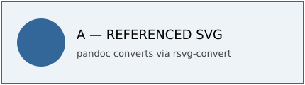
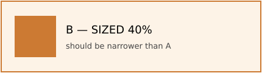
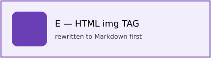
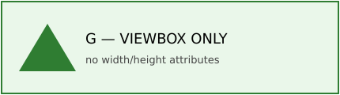
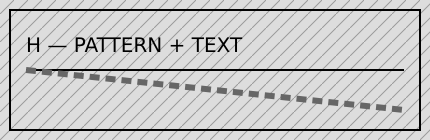

# SVG integration validation

This document exercises every way SVG can reach remarquee. On the tablet,
sections **A through I** should each show a labeled diagram. Section **J** is a
code block and should appear as **monospace text, not an image**.

reMarkable renders in grayscale, so the colors below appear as different gray
levels. Each diagram has a letter and a title inside it.

## Expected results

- [ ] A — referenced SVG renders
- [ ] B — referenced SVG with width=40% renders and is narrower than A
- [ ] C — inline raw <svg> renders
- [ ] D — nested inline <svg> renders
- [ ] E — HTML  renders
- [ ] F — data:image/svg+xml URI renders
- [ ] G — viewBox-only SVG renders
- [ ] H — pattern and text render legibly
- [ ] I — inline SVG with a quoted '>' in an attribute renders
- [ ] J — fenced code containing <svg> stays code text

## A — Referenced SVG



## B — Referenced SVG, sized 40%

{width=40%}

## C — Inline raw SVG block

<svg xmlns="http://www.w3.org/2000/svg" width="430" height="120">
  <rect x="2" y="2" width="426" height="116" fill="#eef8ee" stroke="#2f7d32" stroke-width="2"/>
  <circle cx="58" cy="60" r="34" fill="#2f7d32"/>
  <text x="108" y="55" font-family="DejaVu Sans" font-size="18" fill="#000000">C — INLINE RAW SVG</text>
  <text x="108" y="80" font-family="DejaVu Sans" font-size="13" fill="#444444">extracted and converted by remarquee</text>
</svg>

## D — Nested inline SVG

<svg xmlns="http://www.w3.org/2000/svg" width="430" height="120">
  <rect x="2" y="2" width="426" height="116" fill="#e8f6f8" stroke="#26727a" stroke-width="2"/>
  <svg x="24" y="24" width="72" height="72" viewBox="0 0 24 24">
    <rect width="24" height="24" fill="#26727a"/>
    <circle cx="12" cy="12" r="8" fill="#ffffff"/>
  </svg>
  <text x="112" y="55" font-family="DejaVu Sans" font-size="18" fill="#000000">D — NESTED INLINE</text>
  <text x="112" y="80" font-family="DejaVu Sans" font-size="13" fill="#444444">inner element balanced correctly</text>
</svg>

## E — HTML img tag



## F — Data URI SVG


## G — viewBox-only referenced SVG



## H — Pattern and text



## I — Inline SVG with quoted '>' in an attribute

<svg xmlns="http://www.w3.org/2000/svg" width="430" height="120" data-note="a > b">
  <rect x="2" y="2" width="426" height="116" fill="#fdfbe6" stroke="#b5a21c" stroke-width="2"/>
  <rect x="24" y="24" width="72" height="72" fill="#b5a21c"/>
  <text x="112" y="55" font-family="DejaVu Sans" font-size="18" fill="#000000">I — QUOTED ATTR</text>
  <text x="112" y="80" font-family="DejaVu Sans" font-size="13" fill="#444444">attribute value contains '>' safely</text>
</svg>

## J — Fenced code (must stay code, not an image)

```xml
<svg xmlns="http://www.w3.org/2000/svg" width="20" height="20">
  <rect width="20" height="20" fill="#ff0000"/>
</svg>
```

End of validation document.
